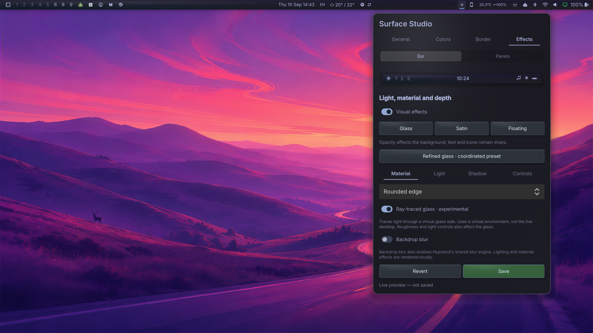

# Surface Studio Bar

A replacement Omarchy bar with Surface Studio built in. One plugin installs both the bar and its appearance editor. No upstream patch or separate `adam.bar` / `adam.surface-studio` installation is required.



*Live screenshot with the Effects tab open. Bar and panel styling can be configured separately.*

## Install

```bash
omarchy plugin add https://github.com/adamritter/omarchy-surface-studio --enable
```

Enabling selects this bar while preserving the configured widgets and their settings. The ◈ Surface Studio button appears automatically on the right (or in the position of an existing editor). The plugin does not install or modify your network, tray, clock, or other widgets.


## Remove

For a marketplace/Git installation, run `omarchy plugin remove io.github.adamritter.surface-studio`. Omarchy handles the bar fallback. Your saved `~/.config/omarchy/surface-studio.json` is retained.

## Dependencies

Requires Omarchy Quattro with its running shell, Quickshell, Qt 6 Quick/Controls and ShaderTools runtime, Hyprland (`hyprctl`), and Bash. These are supplied by the tested Omarchy environment. Shader rebuilding requires Qt 6 `qsb`. Bundled stock widgets use Omarchy commands, and the keyboard-layout widget uses `xkbcli`. No additional network service or account is needed.

## Use

Open ◈. The editor and status messages are in English:

- **General**: enabled surfaces and bar transparency.
- **Colors**: four-corner, linear or radial gradients, graphical color picker and hex values.
- **Border**: border width, colors and panel rounding.
- **Effects**: material, light, shadow and controls. **Controls → Custom button colors** sets idle, selected and hover colors.
- **Save** saves; **Revert** restores the saved appearance.

Bar and panel profiles are separate. Changes preview immediately; closing the editor keeps the preview, while restarting discards unsaved edits. Settings are stored at `~/.config/omarchy/surface-studio.json`, so an existing Surface Studio setup is reused. The file and its contents are not bundled.

## Scope and compatibility

Tested with the user's Omarchy Quattro development shell based on `fed2d225`, Qt 6.11 and Quickshell. This is an experimental full-bar plugin, not a claim of compatibility with every Omarchy release. See UPSTREAM.md for provenance and maintenance boundaries.

Panel styling adapts common Omarchy popup, Button, CursorSurface and PanelActionButton components. Custom plugin controls may retain their own style. It does not style ordinary application windows. Native popup windows clip external shadows; full-screen KeyboardPanel surfaces can draw them.

Backdrop blur uses runtime Hyprland layer rules and may enable the shared blur engine. Actual desktop refraction is not implemented. Disabling effects restores the original blur baseline; reload Hyprland after removing the plugin if runtime blur overrides were active. Shader lighting itself is local to QML. Binary bar transparency still hides the bar fill and shadow.

## Development

GLSL sources and their compiled Qt shader packages are included. Run `./build-shaders.sh` after shader changes. Run `python3 -m unittest discover -s tests` for package checks. Installation and removal use Omarchy’s own plugin manager.

MIT licensed; includes Omarchy bar code (see LICENSE and UPSTREAM.md).

## Ray-glass experiment

Effects → Material includes optional analytic ray-traced glass for bar and panel profiles. It uses a virtual environment, not the live desktop. See [the tuned appearance preset](presets/README.md) and [technical limitations](studio/README.md#experimental-analytic-ray-glass).
